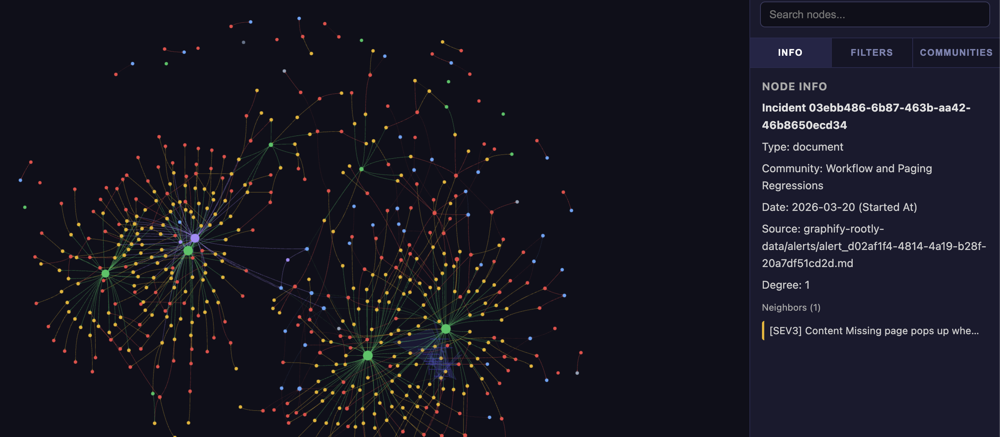

<p align="center">
  
</p>

# rootly-graphify

Built on [graphify](https://github.com/safishamsi/graphify), a tool inspired by [Andrej Karpathy's LLM Wiki idea](https://gist.github.com/karpathy/442a6bf555914893e9891c11519de94f) — instead of rediscovering knowledge from scratch on every query, have an LLM build a persistent, structured knowledge graph that grows richer over time. Graphify takes any folder of files and turns it into a queryable graph with communities, connections, and confidence scores. This fork points it at the Rootly API.

Connect the Rootly API, collect incidents, alerts, and teams for a selected time window, export them into a local corpus, and turn that corpus into a queryable knowledge graph. Use `graphify rootly` for collection and `/graphify` in Claude Code or Codex when you want deeper semantic analysis on top.

<p align="center">
  
</p>

---

## Install

**Fresh install (Graphify + Rootly importer):**
```bash
pip install "graphifyy[rootly]"
graphify install            # Claude Code
graphify install --platform codex  # Codex
```

**Add Rootly importer to an existing Graphify setup:**
```bash
pip install "graphifyy[rootly]" --upgrade
```

---

## Set your Rootly API key

Create a `.env` file in your project root:

```dotenv
ROOTLY_API_KEY=rootly_...
```

---

## Run the workflow

### Step 1: Fetch and build *(terminal)*

Fetches incidents, triggered alerts, and teams. Builds the initial graph with severity colors, alert filters, and team/service layers.

```bash
graphify rootly
```

Non-interactive:
```bash
graphify rootly --api-key-env ROOTLY_API_KEY --days 30 --mode standard
```

Outputs written to `graphify-rootly-data/graphify-out/`:
- `graph.html` — open in browser to explore the graph
- `GRAPH_REPORT.md` — god nodes, communities, suggested questions
- `graph.json` — raw graph for querying

---

### Step 2: Add semantic meaning *(agent)*

Runs parallel subagents over the incident corpus to infer cross-incident themes, recurring patterns, and root cause relationships.

**Claude Code** — type in the chat:
```
/graphify graphify-rootly-data --mode deep
```

**Codex** — type in the chat:
```
run graphify on graphify-rootly-data --mode deep
```


---

## What you can explore

| Pattern | What it shows | Why a graph helps |
|---|---|---|
| **Service incident heatmap** | Which services are on fire and how badly. Node size = incident count, color = worst severity. | Clusters services that tend to fail together, revealing hidden infrastructure dependencies. |
| **Team on-call & escalation map** | Who covers what across all schedules and escalation policies in one view. | Spots single points of failure — the person on 4 schedules across 3 teams — and coverage gaps. |
| **Alert-to-incident funnel** | Which alert sources produce real incidents vs. pure noise. | An alert source with 200 alerts and 0 incidents is immediately visible by node size. |
| **Incident → action item follow-through** | Are we actually fixing what breaks? Solid edges = completed, dashed = open. | Clusters of open action items around a team or service expose systematic follow-through problems. |
| **Cross-service failure correlation** | Which services fail together within the same time window. | Community detection finds shared-fate groups that likely depend on the same underlying infrastructure. |

---

## What gets collected

| Resource | What | Filter |
|---|---|---|
| Incidents | Title, severity, status, timeline, services, teams, description | Date window (`--days`) |
| Alerts | Summary, status, source, noise flag, timeline | Triggered only (linked to an incident) |
| Teams | Name, slug, service ownership | All teams in account |

---

## Visualization filters

Once `graph.html` is open in a browser:

- **Team** — filter all nodes to a specific team's incidents and services
- **Severity** — show/hide by SEV1–SEV4
- **Incidents** — all or open only
- **Alerts** — triggered (on by default) / orphaned (off by default, not collected)
- **Time range** — slider to narrow the incident window

---

## How it works

`rootly-graphify` has a Rootly collection phase and a graph analysis phase.

1. **Deterministic Rootly collection.** Validate the API key, choose a 7, 30, or 90 day window, fetch incidents whose `started_at` falls inside that window, fetch their triggered alerts via the per-incident sub-resource, fetch all team data, and write everything to a local corpus directory.

2. **Initial Rootly graph build.** The built-in Rootly runner creates nodes for incidents, alerts, teams, and services, wires them together with typed edges (`triggered`, `affects`, `owns`, `responded_by`, `targets`), clusters the graph, and writes `graph.html`, `GRAPH_REPORT.md`, and `graph.json`. The HTML includes severity color coding, team/service layers, and alert filters.

3. **Optional deep enrichment.** Run `/graphify ./graphify-rootly-data --mode deep` to dispatch parallel subagents over the markdown files and infer cross-incident themes, rationale, and conceptual links.

4. **Use the current top-level output.** After semantic enrichment, open `graphify-out/graph.html`. The current generic exporter already includes the maintained filters and visuals directly, so no separate re-apply step is required.

**Clustering is graph-topology-based — no embeddings.** Leiden finds communities by edge density. Semantic similarity edges (`semantically_similar_to`, marked `INFERRED`) influence community detection directly. No separate embedding step or vector database required.

Every relationship is tagged `EXTRACTED` (found directly in source), `INFERRED` (reasonable inference, with a confidence score), or `AMBIGUOUS` (flagged for review).

---

## What you get

**God nodes** — highest-degree incidents or services (what everything connects through)

**Surprising connections** — cross-incident links ranked by composite score, each with a plain-English explanation

**Suggested questions** — 4–5 questions the graph is uniquely positioned to answer about your incident history

**Confidence scores** — every `INFERRED` edge has a `confidence_score` (0.0–1.0). `EXTRACTED` edges are always 1.0.

**Semantic similarity edges** — cross-incident conceptual links with no structural connection. Two incidents caused by the same root pattern without sharing services or teams.

**Token efficiency** — the first run extracts and builds the graph (costs tokens). Every subsequent query reads the compact graph instead of raw markdown — that's where the savings compound. SHA256 cache means re-runs only re-process changed files.

---

## Usage

```text
# --- Rootly workflow (terminal) ---
graphify rootly                                        # interactive Rootly import flow
graphify rootly --days 30                              # collect last 30 days of incidents
graphify rootly --api-key-env ROOTLY_API_KEY           # non-interactive key lookup from env
graphify rootly --output ./my-rootly-corpus            # write corpus to a custom folder

# --- Semantic enrichment (agent: Claude Code / Codex) ---
/graphify ./graphify-rootly-data                       # analyze the Rootly corpus
/graphify ./graphify-rootly-data --mode deep           # more aggressive INFERRED edges
/graphify ./graphify-rootly-data --update              # re-extract only changed files

# --- Query the graph (agent) ---
/graphify query "which services have the most recurring incidents?"
/graphify query "what patterns connect the SEV1 incidents?"
/graphify path "payment-api" "auth-service"
/graphify explain "Incident: Database connection pool exhausted"

# --- Optional exports ---
/graphify ./graphify-rootly-data --wiki                # agent-crawlable wiki per community
/graphify ./graphify-rootly-data --no-viz              # skip HTML, report + JSON only
/graphify ./graphify-rootly-data --obsidian            # Obsidian vault

# --- Always-on assistant instructions ---
graphify claude install                                # CLAUDE.md + PreToolUse hook (Claude Code)
graphify codex install                                 # AGENTS.md (Codex)
```

---

## Re-run on new data

```bash
# Fetch fresh data and rebuild
graphify rootly --api-key-env ROOTLY_API_KEY --days 30 --mode standard

# Re-enrich with semantic step (Claude Code)
/graphify graphify-rootly-data --update
```

